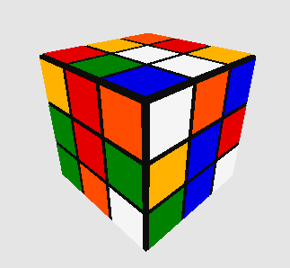

# Rubik's Cube Solver (made with OpenTK)
My Rubik's Cube Project made with exclusively OpenTK (C# library for OpenGL) and Windows Form App. This repo is a showcase of this project.

The goal of this project is to help **new** users to Rubik's Cubes solve their own cubes, with the assistance of this program. Many people who buy Rubik's Cubes do not manage to solve them, so this program's goal is to help with that. (It's purpose is not to solve the cube as quickly as possible).

This is also one of my first major coding projects.

This program solves Rubik's Cubes with the Layer by Layer method, which is the simplest method (and also longest method time-wise). But it's great for beginners to follow and learn how to solve a 3x3 Rubik's Cube.

This involved learning about:
- Transformation Matrices and OpenTK/OpenGL, to create, present, rotate/transform a Rubik's Cube on-screen:
Image from OpenTK official docs:

- Implementing Basic Animations
- The Rubik's Cube Solving Algorithm
- Windows Form App UI

## Rubik's Cube Solver Downloadable Executable
My program relies on Windows Form App, thus only runs on Windows.
Here's the SHA256 hash for my rubiks-cube-release.7z: 536A1F2F5A3E134BEC8F88B72EF42386F3454342D0377A4B1377F1EA1299ED1D

I've checked my release file on VirusTotal, and it doesn't get flagged for anything.
There's no file/path handling actively used in the code either.

This repository is also archived and read-only. I do not plan to make further changes to this project.
The Net Menu only has basic error checking, and doesn't check for pieces that can't exist.

## MP4s showcasing this project:

### Net Menu
https://github.com/user-attachments/assets/063618c6-c615-4151-93f2-fd8f680566ab

### Scramble
https://github.com/user-attachments/assets/782c949e-b611-43de-b965-fb8f07224c9a

### Solve First Layer
https://github.com/user-attachments/assets/6d115295-711a-40d7-8880-759edab1a7cd

### Previous Next Steps After First Layer
https://github.com/user-attachments/assets/2aab50e5-5213-49ec-9586-720ad5378eee

### Solve Top Two Layers
https://github.com/user-attachments/assets/133e2bc0-6086-4f2e-950a-9d15a802e41b

### Solved Cube
https://github.com/user-attachments/assets/93f9bf58-cb67-4e73-84f5-a1b28a1d97d8

### Previous Next Steps On Solved Cube
https://github.com/user-attachments/assets/0ae249aa-9013-44fd-9e89-f301067a5f95

### Reset Colors
https://github.com/user-attachments/assets/113c9277-d707-4048-a3b0-2f7433e8b633
